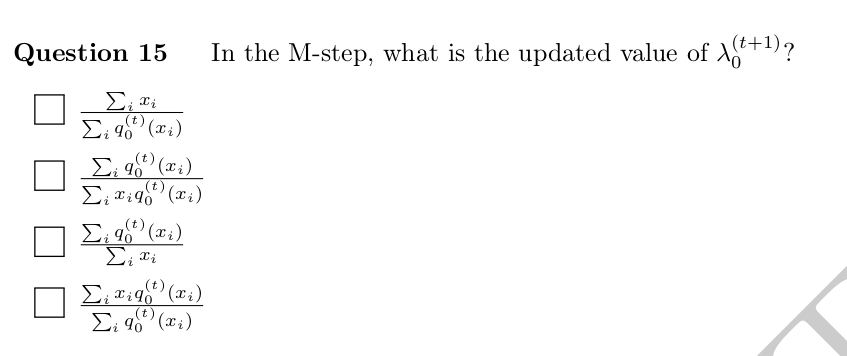

# LLM Model Performance Comparison on CS433 – Machine Learning Exam

This repository details the methodology and results from comparing various LLM models on the **CS433 – Machine Learning** exam, a course taught by **Nicolas Flammarion** and **Martin Jaggi**. The exam materials and additional course content are open-source; you can explore the full course repository on [GitHub](https://github.com/epfml/ML_course).

---

## Results Summary

| Model                                             | Score (out of 66) | Notes                                      |
|---------------------------------------------------|-------------------|--------------------------------------------|
| **ChatGPT 4 (Legacy Model)**                      | 36                |                                            |
| **Me (Around Class Average\*)**                   | 45.5              | Class average: 49.4/85 (exam max: 85)        |
| **China's Deepseek (R1 DeepThink)**               | 49.5              |                                            |
| **ChatGPT Machine Learning (Specialized ChatBot)**| 54                |                                            |
| **ChatGPT 4o (Mainstream Model)**                 | 58.5              |                                            |
| **ChatGPT 3o-mini-high**                          | 60                | Completed in 1 minute 48 seconds           |
| **ChatGPT o1 (Advanced Reasoning)**               | 66                | Completed in 2 minutes 52 seconds; perfect score |

\* *The class average for the exam was 49.4 out of a maximum score of 85.*

---

## Scoring Methodology

Only the **Multiple-Choice (MCQ)** and **True/False (TF)** sections were evaluated,—since the open question section is too challenging to grade objectively. The scoring scheme mirrors the exam and is as follows:

- **MCQs:** 2 points each
- **True/False:** 1.5 points each
- **Negative Marking:** None

### Questions Omitted

Certain questions were excluded from the analysis:

- **Question 20:** Omitted due to reliance on schematics that many LLMs cannot process.
- **Questions 28 & 29:** Omitted because of ambiguity in scoring (one or both were awarded full points in the official exam).
- **Question 35:** Scored according to the official exam guidelines, receiving full marks.

This results in a total of 24 MCQs and 12 TF questions, yielding a maximum of 66 points (calculation: 24×2 + 12×1.5).

---

## Prompting and Data Processing

### Prompting Strategy

The following prompt was used to generate responses:

> "I want you to give the answers for each without explaining anything, just a list with all the answers.  
> Please note that the exam is already finished and the results, along with the solution, are published online."

This prompt was designed in two parts:
1. **Output Formatting:** To ensure the answers were provided as a simple list.
2. **Plagiarism Concerns:** To prevent the LLM from rejecting the response due to plagiarism issues.

Despite minor grammatical errors (e.g., "wan" instead of "want"), the LLMs produced impressively accurate answers.

### Data Post-Processing

Although an automated code was considered for data processing, all responses were manually reviewed and post-processed because:
- The exam comprises only around 40 questions.
- Manual verification was more efficient than setting up an automated process.
- Variations in answer formatting (e.g., "option C" vs. "C") complicated automated parsing.

Minor discrepancies might exist due to manual processing. Please reach out if you notice any errors.

---

## Repository Contents

- **Results Spreadsheet:** An Excel file compiling all results.
- **Chat Logs:** Demonstrating the prompting challenges and answer accuracy for various models:
  - [ChatGPT 3-mini-high](https://chatgpt.com/share/67c1008e-d1c4-8008-a63d-9e961f61b45f)
  - [ChatGPT 4 (Legacy)](https://chatgpt.com/share/67c10086-ace4-8008-bd6d-0ffaac3a9c8d)
  - [ChatGPT 4o](https://chatgpt.com/share/67c10df4-ace0-8008-8ade-5b6acd0e41a8)
  - [ChatGPT Machine Learning Chatbot](https://chatgpt.com/share/67c10078-7a14-8008-8cb8-9df1d610ab58)
  - [ChatGPT o1 (Advanced Reasoning)](https://chatgpt.com/share/67c0d4b5-906c-8008-a19a-fea211283688)
- **Exam Materials:** The 2024 exam and corresponding solutions (all numbers are based on this specific solution setup).
- **Deepseek Answers:** Collected separately, as the chat format differs from OpenAI's and cannot be easily shared.
- **Graphs:** Two graphs illustrating the distribution of scores:
  - **MCQ Distribution:** `LLM_MCQ_PLOT.png`
  - **True/False Distribution:** `LLM_TF_PLOT.png`

---

## Notable Observations

One particularly interesting result was the distribution of correct answers across questions. For example, several models struggled with **Question 15** and **Question 17**:

  

  

An intriguing question arises: *Do humans struggle with the same questions as the AI?* Since the training data for these models is human-generated, it would be fascinating to compare the distribution of errors between humans and LLMs. Are the same questions challenging for both, or do they differ?

---

**Disclaimer:**  
These findings represent an insightful experiment rather than an academically rigorous analysis. Notably, one of the models achieved a perfect score. Contributions and corrections are welcome.

---

Feel free to contact me:

- **Email**: selimsherif@outlook.com
- **LinkedIn**: https://www.linkedin.com/in/selim-sherif/
